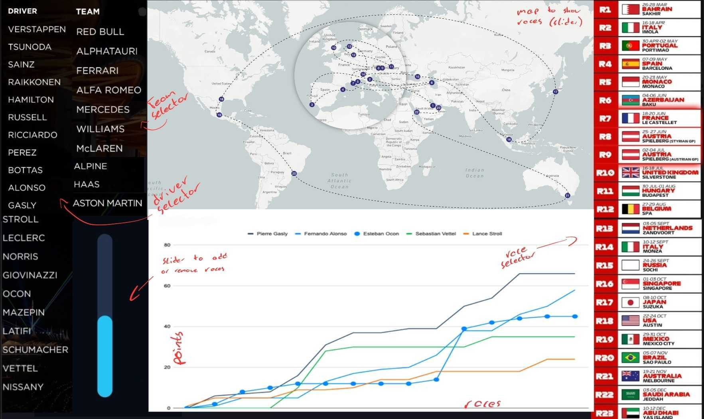
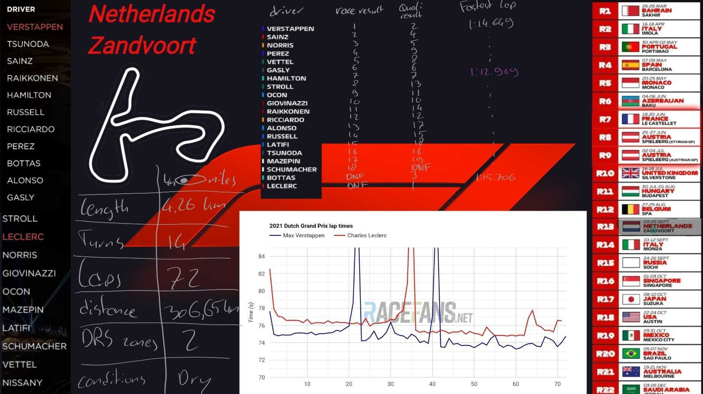

# Proposal

# Section 1: Motivation and Purpose

-   Our role: Data scientists in the sports industry

-   Target audience: Formula 1 Fans interested in analyzing the 2021 Season

The 2021 Season for Formula 1 World Championship was an intense season filled with suspense and plot twists. Unfortunately, the results of the race are displayed on the official website through a series of clunky tables that are difficult to navigate and can be difficult to make comparisons or do analysis with, not to mention the data itself is presented in very plain manner with minimal flexibility or engagement. As data scientists in the industry who seek to present this data in a more informative and interesting way, we propose building a data visualization app that allows users to easily find overall information for the season, filter for specific teams, drivers, or tracks while being to see how they compare with each other, and clearly and concisely present key summary statistics and information for each race/team/driver. The app will greatly enhance the ease at which information can be accessed in an interactive way, while still presenting comprehensive information for the whole season of interest.

# Section 2: Description of Data

We will be visualizing Formula 1 data having multiple datasets for the year 2021. We will be looking at 8 datasets namely:

The following datasets are extracted from [kaggle](https://www.kaggle.com/datasets/rohanrao/formula-1-world-championship-1950-2020).

-   `lap_times.csv` which contains lap times of each individual laps for all the drivers.
-   `pit_stops.csv` which contains the duration of pit stops, the lap in which the driver took it and the race_id.
-   `circuits.csv` references the circuit_id to the `lap_times.csv` and `pit_stops.csv`.
-   `drivers.csv` references the driver_id to the `lap_times.csv` and `pit_stops.csv`.
-   `races.csv` which references all the collated data to the individual races of the 2021 f1 season.

All this is done in the EDA notebook as well for reference

-   The `formula1_2021season_drivers.csv` which provides personal information and their all time best stats and records in formula 1.
-   The `formula1_2021season_calendar.csv` contains information on each of the 22 tracks used in 2021. Information about lap records, track dimensions, etc.
-   The `formula1_2021season_raceResults.csv` includes information about the final race positions, lap times and points of each f1 driver in all the races that happened in 2021.
-   The `formula1_2021season_sprintQualifyingResults.csv` includes information about the final race positions, lap times and points of each f1 driver in all the races that happened in 2021.
-   The `formula1_2021season_teams.csv` includes information about the 10 teams that participated in f1 2021 season, such as full team names and their records and achievements.

The track maps taken are extracted from [f1.com](https://www.formula1.com) and the flags of each country are taken from [Wikipedia](https://en.wikipedia.org/wiki/Main_Page).

# Section 3: Research Questions and Usage Scenarios

Tom is an avid Formula 1 fan who wishes to explore in detail the 2021 Season of F1 races, such as how his favourite driver fares against his rivals and discover details about the circuits that were raced on for that season. He wants to be able to compare the points acquired by his favourite driver throughout the season to other drivers who are similar in calibre. With this information, Tom can identify the turning points in the season in which his favourite driver surpassed his rivals. When Tom goes on the F1 2021 Analysis App, he can see the final standings of the drivers and teams along with their respective points acquired for the season. By clicking on the drivers to filter for specific drivers, Tom can visualize and [compare] the points gained by these drivers throughout the season in a line chart. From the line chart, Tom can see which races were pivotal in a driver's success in gaining points and compare the final point difference between drivers. He can also choose to do the same for his favourite team. By selecting a circuit, Tom can [explore] various statistics about the circuit such as the circuit length, number of turns, and number of laps required to complete the race. A summary of the results of the race on that circuit will also be displayed in a table, such as the driver's start and finish position and their fastest laps. If he also filters for a driver, he can explore the driver's lap times throughout the race on that circuit with a line chart that displays the lap times for each lap, the tires that were used, and pit stops taken. This allows Tom to analyze the team's strategies through the race and decide whether the team could have made a different decision that would have improved the results.

# App Sketches

